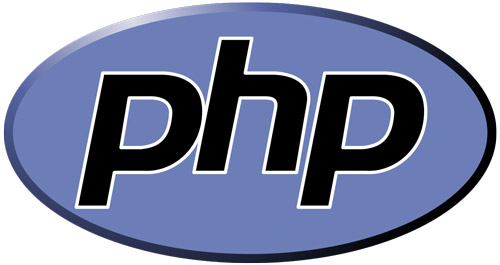

# Curso PHP Completo

Curso de PHP do Básico ao Avançado.



```php
<?php
  /* Código de boas vindas */
  $mensagem_boas_vindas = "Sejam todos bem vindos!";
  echo $mensagem_boas_vindas;
?>
```

## Grupo do facebook 

Entra lá para receber todas as novidades e interagir com outros alunos e com o professor:

[Webschool.io Curso -  PHP do básico ao avançado](https://www.facebook.com/groups/704478526318727/)

## Site do curso
[www.phpcompleto.com.br](http://www.phpcompleto.com.br)

## Ementa

### MODULO 1 - INTRODUÇÃO

- [Introdução ao curso](material-didatico/modulo-1/aula 1 - introducao/introducao.md)
- [Introdução ao PHP](material-didatico/modulo-1/aula 2 - o php/o php.md)
- Instalação e Configuração do PHP(Será comentado sobre Extensões, Opções, CLI e o PHPinfo)
  - Windows
  - Linux 
  - MacOS
- Sintaxe Básica 

### MODULO 2 - BASE INICIAL

- Tipos
- Variáveis
- Constantes
- Expressões
- Operadores
  - Aritméticos
  - Atribuição
  - Bit-a-bit
  - Comparação
  - Erro
  - Execução
  - Incremento
  - Decremento
  - Lógicos
  - Tipo
- Estruturas de Controle
  - if
  - else
  - while
  - do-while
  - for
  - foreach
  - break
  - continue
  - swith
  - declare
  - return
  - require
  - include
  - require_once
  - include_once
  - goto
- Funções
  - def pelo usuário
  - argumentos
  - retornando valores
- Classes e Objetos  
- Namespaces 
- Standard PHP Library
- Exceções
- Generators 
- Referências
  - o que sao
  - o que fazem
  - passando referencias
  - retornando
  - destruindo
  - demonstrando
- Variáveis pré definidas 
  - superglobais
  - $_SERVER
  - $_GET
  - $_POST
  - $_FILES
  - $_REQUEST
  - $_SESSION
  - $_COOKIE
  - $argc
  - $argv
- Protocolos e wrappers suportados
  - file
  - http
  - ftp
  - php
  - zlib
  - data
  - glob
  - phar
  - ssh2
  - rar
  - ogg
  - expect

### MODULO 3 - BANCO DE DADOS

- O que é um banco de dados
- Mysql 
- Mysql com PDO
- MongoDB
- Postgresql

### MODULO 4 - Autenticação e arquivos

- Autenticação HTTP com php
- Cookies
- Sessões
- Upload de arquivos
  - exemplos
  - mensagens de erro
  - multiplos arquivos
  - método PUT
- Arquivos remotos 
  - copiando remoto
  - salvando remoto
- Safe Mode
- Php pela linha de comando
- URLs amigáveis e outras opções do .htaccess

### MODULO 5 - EXTENSÕES

- Extensões de arquivos e compressão 
  - bzip2
  - lzf
  - phar
  - rar
  - zip
  - zlib
- Extensões para criptografia   
  - crack
  - hash
  - mcrypt
  - mshash
  - password hashing
  - md5
- Extensões de data e hora 
  - calendario
  - data/hora
- Extensões relacionadas a Sistema de Arquivo   
  - diretórios
  - fileinfo
  - filesystem
  - mimetype
- Processamento e geração de imagens 
  - biblioteca GD
- Extensões relacionadas a Mail 
  - imap
  - mail
  - PHPMailer
- Extensões matemáticas 
  - math
  - statistics
- Outras extensões básicas 
  - geoip
  - JSON
- Outros serviços
  - curl
  - ftp
- Extensões relacionadas com XML
  - SimpleXML

### MODULO 6 - SEGURANÇA

- Introdução
- Considerações Gerais
- Segurança do sistema de arquivos
- Segurança da base de dados
- Segurança de senhas
- Filtro de dados enviados pelo usuário
- Escondendo o PHP

### MODULO 7 - ASSUNTOS GERAIS

- Dicas desempenho e otimização
- TDD (Desenvolvimento Orientado a Testes)
- Dicas profissionais/mercado
- Git com Test and Deploy
- Introdução aos frameworks

## Professor

[Vagner Kaefer](https://www.facebook.com/vagkaefer)
